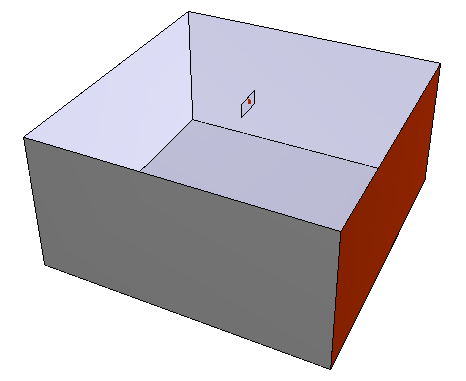
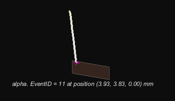

**Date:** 25/January/2022

**Author:** Javier Galan (javier.galan@unizar.es)

This example tests the generation of alphas with a well defined energy from a thin foil immersed in a gas volume.

#### Detector geometry

The geometry consists of a 10x10x10cm3 box made of Argon gas. In the middle of the box a small copper plate is placed. The thickness of the plate in um can be controlled with an enviromental system variable, REST_FOIL.

#### Event generator
The event generator will produce mono-energetic alphas produced in the copper sample volume (physical volume named source). The energy of the alphas can be controled using the REST_ENERGY system environment variable expressed in MeV.

#### Testing the example

Create a "data" directory if not existing already

```
mkdir data
```

Execute the following to launch the generation of 10,000 alphas.

```
restG4 alphas.rml
```

Execute the following to launch the processing of the generated events and produce few observables inside the analysis tree.

```
restG4 --c analysis.rml --f data/FileGenerated.root
```

See also `../../.gitlab-ci.yml` and `Validation.C` for validation routines executed in the pipeline. The following plot is generated using the pipeline.


Commands to reproduce the figure shown follow:

```
mkdir data
export REST_ENERGY=5
export REST_FOIL=1
restG4 alphas.rml

export REST_FOIL=5
restG4 alphas.rml

export REST_ENERGY=1
restG4 alphas.rml

restManager --c analysis.rml --f Run_1MeV_5um.root
restManager --c analysis.rml --f Run_5MeV_1um.root
restManager --c analysis.rml --f Run_5MeV_5um.root
restManager --c plots.rml --f "data/*g4Ana*root"
```


A minimal ROOT shell commands to visualize the detector geometry is:

```
export REST_FOIL=5
restRoot
root [0] TRestGDMLParser *g = new TRestGDMLParser()
root [1] TGeoManager *geo = g->GetGeoManager("geometry/setup.gdml")
root [2] geo->GetTopVolume()->Draw("ogl")
```



Minimal ROOT shell commands to visualize events

```
restRootMacros
root [0] REST_Geant4_ViewEvent("data/Run_5MeV_1um.root")
root [1] TGeoManager *geo = g->GetGeoManager("geometry/setup.gdml")
root [2] geo->GetTopVolume()->Draw("ogl")
```


