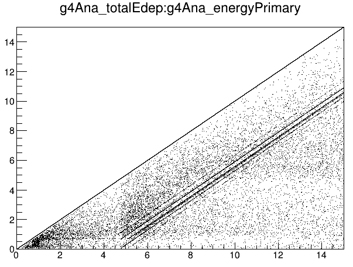

**Date:** 30/September/2022

**Author:** Javier Galan (javier.galan@unizar.es)

#### Detector geometry

This example implements a simple geometry composed by a `detector` box representing a gaseous TPC active volume. The detector has a squared shaped defined by the system variable `GDML_DETECTOR_SIZE` in cm, and a drift distance (defined on the z coordinate) of size `GDML_DRIFT`.

The geometry defines a gas mixture made of Neon and Xenon, the pressure and composition of this mixture can be controlled using `GDML_PRESSURE` in bar, and `GDML_NEON_PCT`.

#### Event generator

The event generator will launch photons parallel to the z-axis towards the center of the detector. The energy of those photons will be homogeneously distributed between 0 and 15 keV.

#### Testing the example

Execute the following to generate a dataset.

```
export GDML_PRESSURE=1.5
export GDML_NEON_PCT=30
export GDML_DRIFT=3
export GDML_DETECTOR_SIZE=6
restG4 DetectorResponse.rml
```

or simply use the bash script

```
source launchResponse.sh
```

Then, populate the analysis tree by executing

```
restManager --c g4Analysis.rml --f Input.root --o Output.root
```

where `Input.root` is the file previously generated by `restG4`.

Then open and explore the file using:

```
restRoot Output.root
[0] new TBrowser
```

#### Results

The execution of the example should produce the following result for pure xenon.


